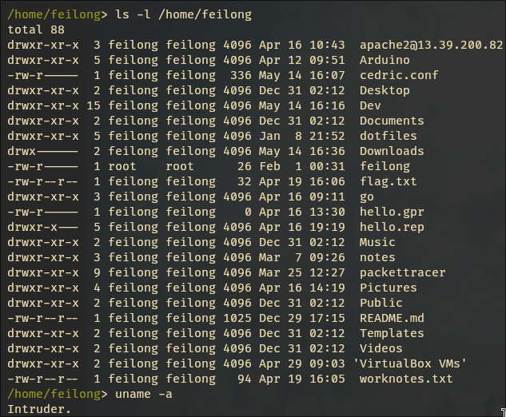

# prank-the-zen
## What is that ?
Prank The Zen is a bash script faking a terminal prompt.
People trying to input a command in your unlocked computer 
will be met with multiple warning messages, as well as a
photo taken by the webcam, and the video opening of the movie
Lupin the 3rd: The first in fullscreen.

## Requirements
- [kitty](https://github.com/kovidgoyal/kitty) (or any emulator allowing the display of images)
- [fswebcam](https://github.com/fsphil/fswebcam)
- [mpv](https://github.com/mpv-player/mpv)

## How to run
```bash
chmod +x prank.sh
./prank.sh
```

## Screenshots

